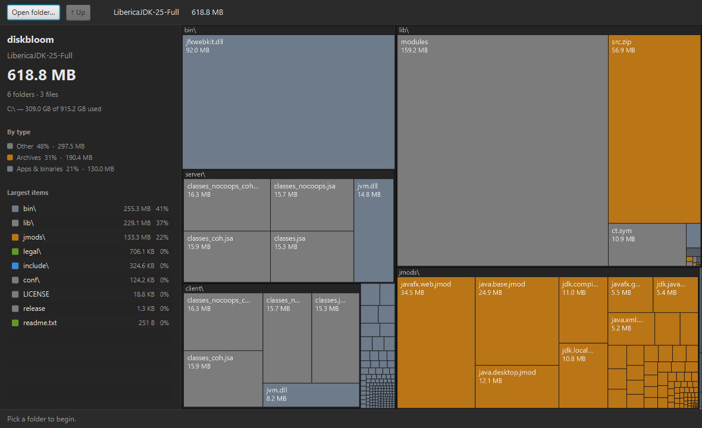

# diskbloom

A local, **LLM-powered file manager & disk cleaner** for Windows — browse your files, see what's eating space, and get on-device AI cleanup advice. Nothing leaves your machine.

> **Status:** work in progress — scanning, the treemap/bar views, a live file browser, search, and the local-LLM assistant + cleanup analyzer all work today.



## Why

Windows disk analyzers make you pick two of: fast, good-looking, open-source, maintained.

| Tool | Fast | Pretty | Open-source | Maintained |
|------|:----:|:------:|:-----------:|:----------:|
| WizTree | ✅ | ➖ | ❌ | ✅ |
| WinDirStat | ➖ | ❌ | ✅ | ✅ |
| SquirrelDisk | ❌ | ✅ | ✅ | ❌ |
| DaisyDisk *(macOS only)* | ✅ | ✅ | ❌ | ✅ |
| **diskbloom** | ✅ | ✅ | ✅ | ✅ |

diskbloom is aiming for all four on Windows — WizTree's speed, DaisyDisk's looks, open source. It's early, so the ✅s in that last row are the target, tracked below.

## Roadmap

- [x] Scan engine — zero-dependency **parallel** walk (ForkJoin across all cores) with one `readAttributes` stat per entry; size aggregation, largest-first, self-checked. ~6.6× faster than the old serial walk (62.5 GB Program Files: 33s → ~5s)
- [x] Desktop UI — nested, type-coloured squarified treemap with drill-down; sidebar with folder summary, drive usage, a by-type legend, and a largest-items list
- [x] Two center views — the treemap or a WinDirStat-style bar list (name · proportional bar · size); toggle in the toolbar. The treemap is navigable: scroll to zoom, drag to pan, double-click a folder to drill in (or empty space to reset)
- [x] Optional auto-scan on launch (off by default — opens to a start screen or your last cached scan; toggle in Settings) with a live progress overlay (files/bytes/current folder + cancel)
- [x] Right-click actions — open, reveal in Explorer, delete to Recycle Bin (recoverable, with confirm)
- [x] Analysis views (under the "Views" menu) — biggest files, "big & old" (largest files, least-recently-modified first), and a file-type breakdown (which extensions use the most space; click one to filter to those files)
- [x] Optional local-LLM assistant (Ollama) — a chat window to ask what's using space or what's safe to delete, then approve its suggested deletions; fully on-device. Auto-detects the Ollama server on launch (honours `OLLAMA_HOST`); set a custom address or Test/auto-detect it in Settings
- [x] Live file browser — address bar, drive picker, and lazy folder loading to navigate the whole PC, Explorer-style (right-click a folder to scan it or "Measure size" in place, or hit "Measure folders" to size every folder in the listing at once — something Explorer won't do)
- [x] Search / filter — by name, extension (`.mp4`), or type (`type:video`); results shown largest-first
- [x] Cleanup analyzer — the local LLM ranks your biggest files keep-vs-junk (weighing size and age) with reasons and cleaning advice; every suggested deletion is approval-gated, and a safety guard blocks system/`.git` paths
- [x] "Analyze drive & optimize (AI)" — a one-click whole-drive optimization plan (biggest space users, ranked cleanup steps, likely caches/temp/duplicates), approval-gated like the rest
- [x] Conversations & reports are saved locally — every chat/analysis is appended to `%LOCALAPPDATA%\diskbloom\history\chat-*.jsonl`; a "History" button opens that folder
- [x] Duplicate finder — content-hash (SHA-256) detection of identical files across the scan, hashed in parallel across all cores with live progress; approve removing the redundant copies (one is always kept), safety-guarded and recoverable via the Recycle Bin
- [x] Rule-based junk finder (no AI) — flags cache/build folders (`node_modules`, `__pycache__`, `.gradle`…), logs, temp files, thumbnail caches, and installers left in Downloads; same approval checklist and safety guard
- [x] Modern flat dark theme, and a per-root scan cache — every drive/folder you've scanned is remembered and reopens instantly (drive buttons and Open folder reuse the cache; Rescan to refresh)
- [x] Recent menu — reopen any previously scanned drive/folder in one click, straight from its cache (shows size and when it was scanned), or "Clear recent scans" to wipe the cache
- [x] Keyboard shortcuts — Ctrl+O open, F5 rescan, Ctrl+F search, Ctrl+E export, Alt+← up a level, Esc to drop a search or leave an analysis view
- [x] Start screen with an all-drives overview — each drive's used/total bar and free space, with a "cached" badge on drives that open instantly
- [x] Single-instance (only one window at a time) and the version shown in the title bar and sidebar
- [x] Export the scan to CSV (Path, Bytes, Size, Type — one row per file and folder) for a spreadsheet, or to nested JSON (`{name, path, bytes, dir, children}`) for scripting — pick the format by file extension in the save dialog
- [ ] Raw NTFS MFT reading via Win32 FFI for WizTree-class scan speed
- [ ] Hardlink / junction-aware accuracy
- [ ] Packaged installer (jpackage)

## Build & run

Requires JDK 25+ with JavaFX bundled — e.g. [Liberica JDK "Full"](https://bell-sw.com/pages/downloads/). The `--add-modules` flags assume JavaFX is in the runtime image.

### GUI

```sh
javac --add-modules javafx.controls,javafx.swing -d out $(find src -name "*.java")
java  --add-modules javafx.controls,javafx.swing -cp out dev.diskbloom.Launcher
# open straight to a folder:
java  --add-modules javafx.controls,javafx.swing -cp out dev.diskbloom.Launcher "C:\Program Files"
# export a treemap to PNG and exit:
java "-Ddiskbloom.shot=out.png" --add-modules javafx.controls,javafx.swing -cp out dev.diskbloom.Launcher "C:\Program Files"
```

On Windows, `diskbloom.cmd` compiles and launches the GUI for you (and the Desktop shortcut points at it).

### CLI / engine only

```sh
javac -d out src/dev/diskbloom/core/Sizes.java src/dev/diskbloom/core/Scanner.java src/dev/diskbloom/Main.java
java -cp out dev.diskbloom.Main "C:\Users\you\Downloads"   # biggest 20 entries + timing
java -ea -cp out dev.diskbloom.Main --selfcheck            # self-check
```

## License

[MIT](LICENSE).
